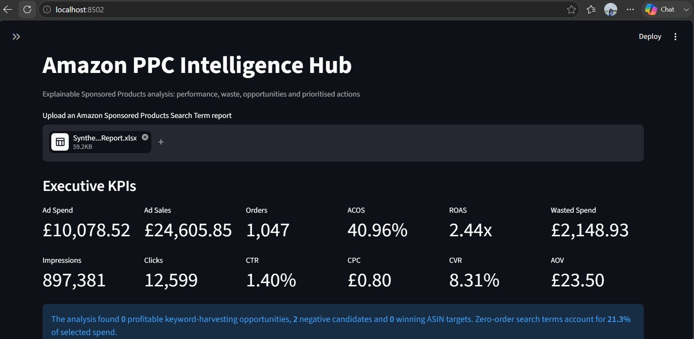
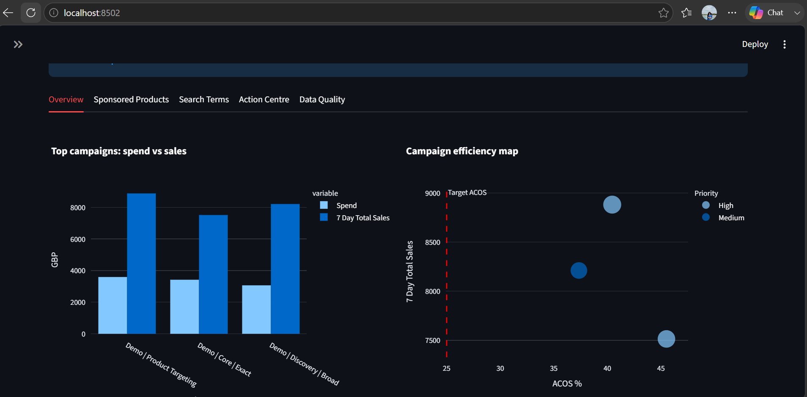
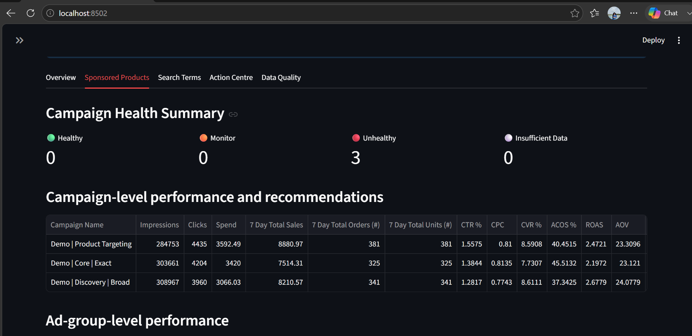
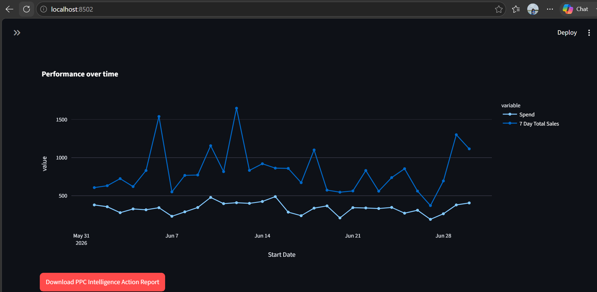

# Amazon PPC Intelligence Hub

An explainable decision-support application for Amazon Sponsored Products Search Term reports. It converts a raw advertising export into executive KPIs, campaign and ad-group drill-downs, keyword and ASIN opportunities, wasted-spend analysis, prioritised actions and a downloadable Excel report.

## Key capabilities

- Recalculates ACOS, ROAS, CTR, CPC, CVR and AOV correctly from aggregated totals.
- Supports campaign and match-type filtering.
- Aggregates repeated customer search terms before evaluating performance.
- Identifies profitable exact-match harvesting opportunities.
- Detects negative keyword candidates using configurable evidence thresholds.
- Identifies converting ASINs for product-targeting review.
- Produces explainable campaign, ad-group and search-term actions with priority, reason, estimated bid adjustment and suggested CPC.
- Distinguishes poor performance from insufficient evidence.
- Exports eight professionally structured Excel worksheets.
- Includes data-quality checks and transparent limitations.

## Set up in PyCharm

1. Open the `PPC_Intelligence_Hub` folder in PyCharm.
2. Select **Python 3.13** as the interpreter and allow PyCharm to create a virtual environment.
3. Open the PyCharm terminal and run:

   ```bash
   python -m pip install -r requirements.txt
   ```

4. Start the application:

   ```bash
   python -m streamlit run app.py
   ```

5. Upload an Amazon Sponsored Products Search Term report (`.xlsx`).

For a confidential-data-safe demonstration, generate a fictional workbook:

```bash
python create_synthetic_demo.py
```

Then upload `Synthetic_Sponsored_Products_Report.xlsx` to the application.

## Expected source fields

The application requires campaign, ad group, targeting, match type, customer search term, impressions, clicks, spend, 7-day sales and 7-day orders. It also uses currency, units and start date when available.

## Recommendation methodology

The application uses configurable target ACOS, click and order thresholds. It does not label zero-sales traffic as 0% ACOS. Instead, it treats the ACOS as undefined and evaluates the evidence using clicks, spend and orders. Recommendations are directional decision support and must be reviewed before changes are made in an advertising account.

## Confidentiality

No employer data is bundled with this project. For a public portfolio or Global Talent application, demonstrate the interface with synthetic or anonymised data only. Do not publish campaign names, search terms, ASIN strategy, sales, spend, customer data, credentials or downloadable employer reports without written permission.

## Suggested portfolio evidence

Document the problem, your independent contribution, the technical architecture, validation approach and business outcome. Useful evidence can include anonymised screenshots, a short demonstration video, a public code repository containing only non-confidential code, stakeholder feedback where permitted, and quantified improvements approved for disclosure.

This project can support evidence of technical contribution, innovation and business impact, but the code alone does not guarantee endorsement under any immigration route.

## Application Screenshots

The following screenshots use entirely synthetic demonstration data.

### Executive KPI Dashboard



### Campaign Performance



### Campaign Health Classification



### Performance Over Time


