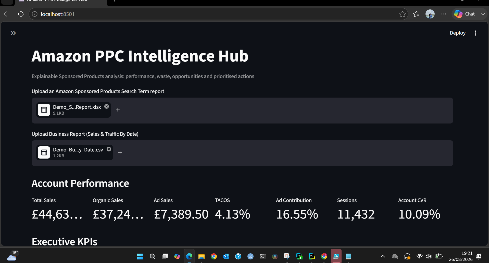
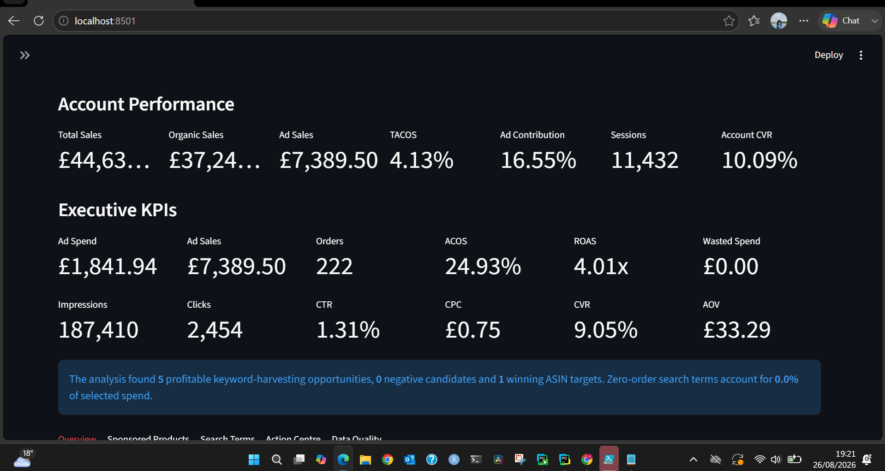

# Amazon PPC Intelligence Hub

An explainable decision-support application for Amazon Sponsored Products advertising. It combines Search Term Report analysis with optional Business Report data to produce account-level KPIs, campaign health classifications, search-term opportunities, prioritised actions and a downloadable Excel report.

## Live demonstration

[](https://devanandha-amazon-ppc-intelligence-hb.streamlit.app)

Try the live application: [Amazon PPC Intelligence Hub](https://devanandha-amazon-ppc-intelligence-hb.streamlit.app)

## Key capabilities

* Calculates ACOS, ROAS, CTR, CPC, CVR and AOV from aggregated totals.
* Combines advertising performance with optional Business Report data.
* Calculates total sales, organic sales, ad sales and TACOS.
* Calculates advertising contribution, sessions and account conversion rate.
* Supports campaign and match-type filtering.
* Aggregates repeated customer search terms before evaluating performance.
* Classifies campaigns as Healthy, Monitor, Unhealthy or Insufficient Data.
* Identifies profitable search terms for exact-match keyword harvesting.
* Detects potential negative keywords using configurable evidence thresholds.
* Identifies converting ASINs for product-targeting review.
* Produces campaign, ad-group and search-term recommendations.
* Provides a priority, explanation, estimated bid adjustment and suggested CPC.
* Identifies wasted spend from search terms with clicks but no attributed orders.
* Exports eight professionally structured Excel worksheets.
* Includes data-quality checks and transparent methodology notes.

## Technology stack

* Python
* Streamlit
* Pandas
* NumPy
* Plotly
* OpenPyXL
* XlsxWriter

## Set up in PyCharm

1. Open the project folder in PyCharm.
2. Select a Python interpreter and create a virtual environment.
3. Open the PyCharm terminal.
4. Install the required packages:

```bash
python -m pip install -r requirements.txt
```

5. Start the application:

```bash
python -m streamlit run app.py
```

6. Open the local Streamlit address displayed in the terminal, normally:

```text
http://localhost:8501
```

## Uploading reports

### Sponsored Products Search Term Report

Upload an Amazon Sponsored Products Search Term Report in `.xlsx` or `.xls` format. This is the primary report required by the application.

### Business Report

Optionally upload a Sales and Traffic by Date Business Report in `.csv` format.

When both reports are uploaded, the application calculates:

* Total sales
* Organic sales
* Advertising sales
* TACOS
* Advertising contribution
* Sessions
* Account conversion rate

## Synthetic demonstration data

No employer or confidential business data is included in this repository.

To create a fictional Sponsored Products report, run:

```bash
python create_synthetic_demo.py
```

Then upload the generated synthetic workbook to the application.

All screenshots in this repository were created using fictional demonstration data.

## Expected Search Term Report fields

The application requires:

* Campaign Name
* Ad Group Name
* Targeting
* Match Type
* Customer Search Term
* Impressions
* Clicks
* Spend
* 7 Day Total Sales
* 7 Day Total Orders (#)

It also uses currency, units, portfolio name and start date when available.

## Expected Business Report fields

The optional Business Report requires:

* Ordered Product Sales
* Units Ordered
* Total Order Items
* Sessions - Total

## Recommendation methodology

The application uses configurable target ACOS, click and order thresholds.

It does not treat traffic with zero sales as having 0% ACOS. ACOS is recorded as undefined where there are no attributed sales, and recommendations are based on the available clicks, spend and order evidence.

Recommendations are directional decision support. Relevance, profitability, placement performance, campaign strategy, attribution, budget constraints and seasonality should be reviewed before applying changes to an advertising account.

## Confidentiality

Do not publish employer campaign names, customer search terms, sales, advertising spend, targeting strategies, credentials or downloadable reports without written permission.

For portfolio demonstrations, use synthetic or appropriately anonymised information only.

## Application screenshots

The following screenshots use entirely fictional demonstration data.

### Account overview



### Executive KPI summary



### Campaign performance charts


### Performance over time


### Campaign health summary


### Search-term performance


### Action Centre


## Portfolio value

This project demonstrates:

* Python application development
* Data cleaning and validation
* Advertising and commercial analytics
* KPI development
* Interactive data visualisation
* Explainable decision-support logic
* Business intelligence reporting
* Confidential-data-safe portfolio development

It can support evidence of technical contribution, independent development and applied business analytics. However, the project alone does not guarantee endorsement under any immigration route.

## Disclaimer

This application is an independent portfolio project and is not affiliated with or endorsed by Amazon. Recommendations should be reviewed by a qualified account owner before implementation.
